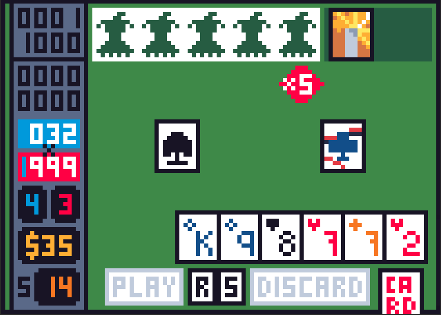
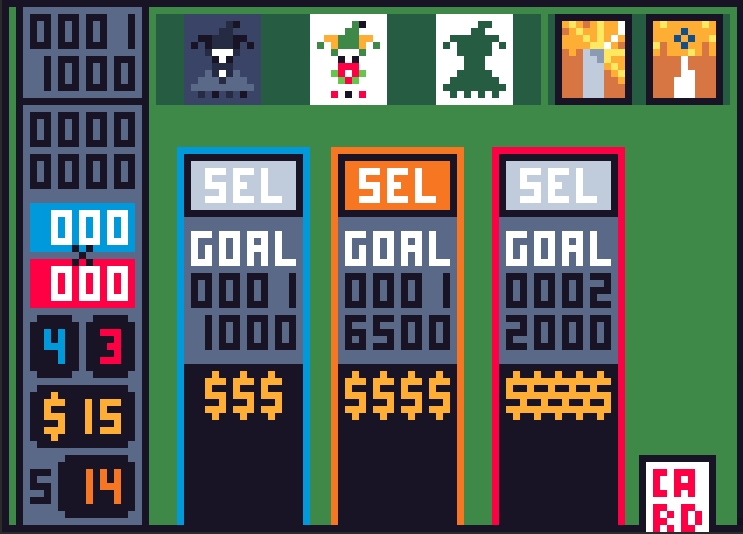

# Badatro - Simple Godot Balatro Clone

Implemented the basic gameplay loop of Balatro, with custom pixel art for 35 Jokers, all 32 vouchers, 22 tarot cards, 13 planet cards, 15 booster packs, 8 enhancements and a 52 card deck.

There exists a few bugs for card animation, and a lack of uncommon jokers leads to an unfair advantage in drawing joker stencils.

## Not Implemented
- Boss Blinds
- Spectral Cards
- Card Edition Shaders
- Round Skipping
- Remaining 100+ Jokers 
- Winning
- Stakes
- Different Decks
- Settings Panel

## Gallery

