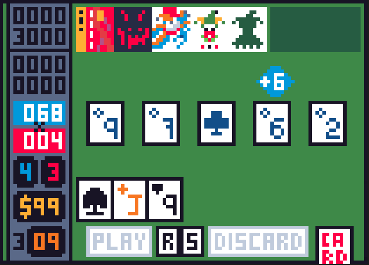
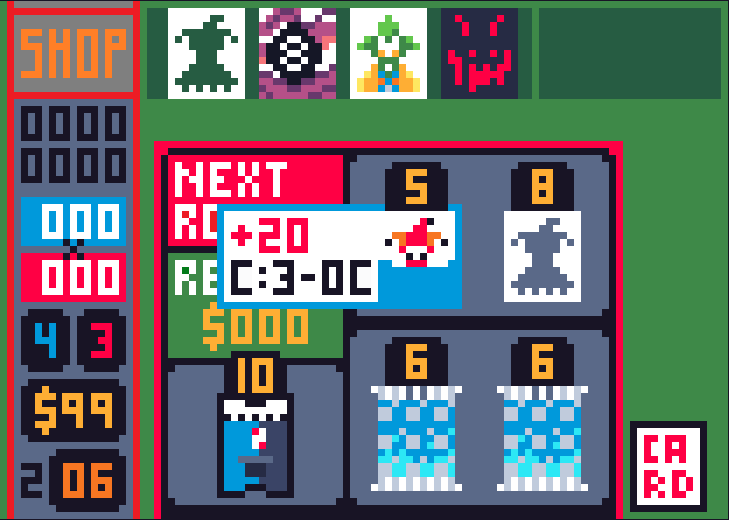
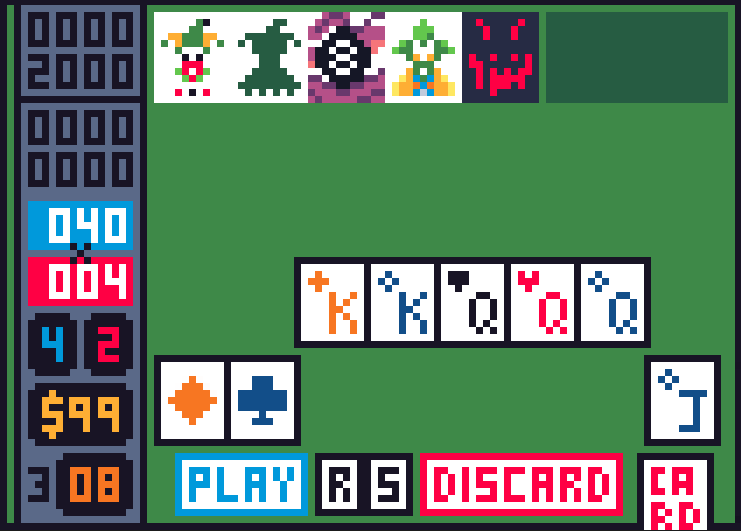
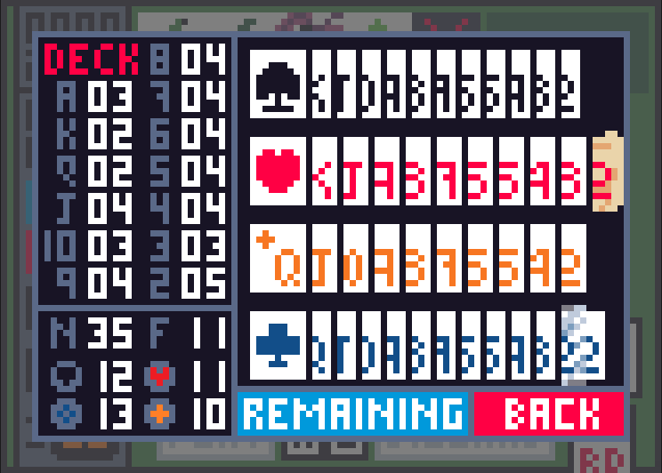
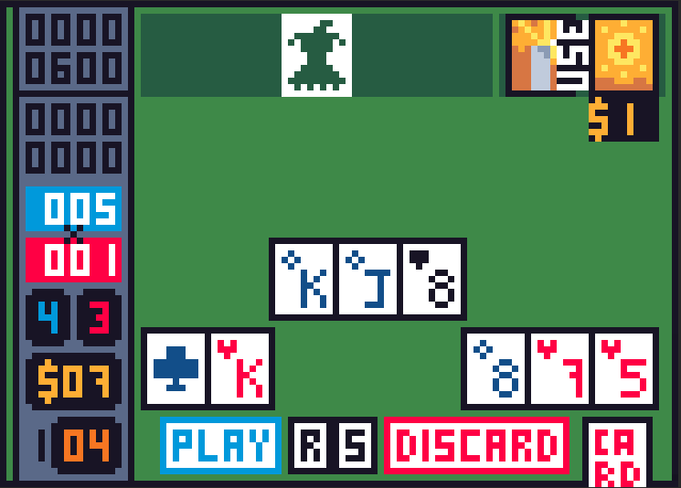

# Badatro - Simple Godot Balatro Clone

Implemented the basic gameplay loop of Balatro, with custom pixel art for 35 Jokers, all 32 vouchers, 22 tarot cards, 13 planet cards, 15 booster packs, 8 enhancements and a 52 card deck.

There exists a few bugs for card animation, and both boss blinds and spectral cards are yet to be implemented.

## Gallery

